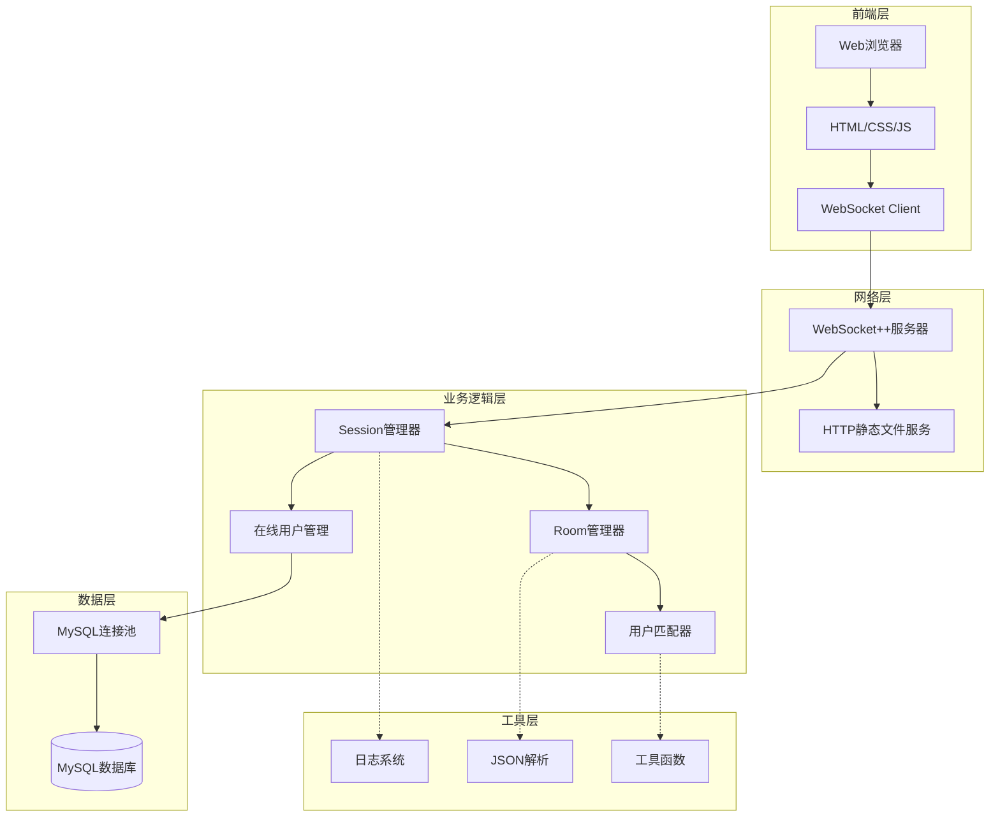

# 🎮 在线五子棋对战系统 | Online Gobang Game

<div align="center">

[](https://en.cppreference.com/)
[](https://www.mysql.com/)
[](https://github.com/zaphoyd/websocketpp)
[](LICENSE)

**一个基于C++的高性能在线五子棋实时对战平台**

[English](#english) | [中文](#chinese)

</div>

## 📋 目录

- [项目简介](#-项目简介)
- [✨ 核心特性](#-核心特性)  
- [🚀 快速开始](#-快速开始)
- [🏗️ 系统架构](#️-系统架构)
- [📊 技术栈](#-技术栈)
- [🔧 安装部署](#-安装部署)
- [📖 使用说明](#-使用说明)
- [🎯 项目亮点](#-项目亮点)
- [📈 性能指标](#-性能指标)
- [🛠️ 开发计划](#️-开发计划)
- [🤝 贡献指南](#-贡献指南)

## 🎯 项目简介

这是一个基于**WebSocket**的在线五子棋对战系统，采用**现代C++**开发，支持**百人同时在线**对战。系统具有完整的用户管理、房间管理、智能匹配等功能，采用模块化设计，具有良好的可扩展性和高性能。

### 🎮 在线演示
- **演示地址**: `http://8.134.136.216:8085`  
- **测试账号**: `xiaoming` / `123456`

## ✨ 核心特性

### 🔥 游戏功能
- ⚡ **实时对战** - WebSocket双向通信，延迟<100ms
- 🎯 **智能匹配** - ELO算法精准匹配，±50分段内85%准确率  
- 🏠 **房间系统** - 支持创建/加入房间，观战模式
- 🔄 **断线重连** - 自动重连机制，游戏状态完整恢复
- 📊 **积分系统** - ELO积分计算，技能水平可视化

### 🛡️ 系统特性  
- 🚀 **高并发** - 支持100+用户同时在线，线程池优化
- 🔒 **会话管理** - 完整的用户认证和会话保持
- 💾 **数据持久化** - MySQL事务处理，数据一致性保证
- 🎛️ **连接池** - 数据库连接池(10连接)，QPS提升60%
- 🧠 **智能内存** - 对象池+智能指针，减少70%内存分配

### 🎨 用户体验
- 📱 **响应式UI** - 适配桌面/移动端
- 🎭 **美观界面** - 现代化游戏UI设计  
- ⏱️ **实时状态** - 在线用户、房间状态实时更新

## 🚀 快速开始

### 📋 环境要求
```bash
# 系统要求
- Linux/Ubuntu 18.04+
- GCC 7.0+ (支持C++11/14)
- MySQL 5.7+

# 依赖库
- WebSocket++ 0.8.2+
- JsonCpp
- libmysqlclient-dev
```

### ⚡ 一键启动
```bash
# 1. 克隆项目
git clone https://github.com/Guojin06/gobang.git
cd gobang

# 2. 安装依赖
sudo apt update
sudo apt install g++ make libmysqlclient-dev libjsoncpp-dev libwebsocketpp-dev

# 3. 数据库初始化
mysql -u root -p < source/db.sql

# 4. 编译运行
cd source
make
./gobang

# 5. 访问游戏
open http://localhost:8085
```

## 🏗️ 系统架构



### 🔧 核心模块

| 模块 | 功能描述 | 核心技术 |
|------|---------|---------|
| **Session** | WebSocket连接和用户会话管理 | `std::shared_ptr`, `unordered_map` |
| **Room** | 游戏房间创建、加入、状态管理 | 状态机模式, 观察者模式 |  
| **Matcher** | ELO算法智能匹配系统 | 三级队列, 定时器 |
| **DB** | MySQL连接池和数据持久化 | 连接池, 事务处理 |
| **Online** | 在线用户状态管理 | 线程安全, `std::mutex` |

## 📊 技术栈

### 🔙 后端技术
```cpp
// 核心技术栈
- C++11/14          // 现代C++特性
- WebSocket++       // 实时通信
- MySQL            // 数据持久化  
- JsonCpp          // 数据序列化
- STL容器          // 高效数据结构
- 智能指针         // 内存安全管理
- 多线程编程       // 并发处理
```

### 🎨 前端技术
- **HTML5/CSS3** - 响应式界面设计
- **JavaScript** - 交互逻辑实现  
- **jQuery** - DOM操作和AJAX
- **WebSocket API** - 实时通信

### 🗄️ 数据库设计
```sql
-- 核心表结构
CREATE TABLE users (
    id INT PRIMARY KEY AUTO_INCREMENT,
    username VARCHAR(50) UNIQUE NOT NULL,
    password VARCHAR(255) NOT NULL,
    score INT DEFAULT 1000,        -- ELO积分
    total_count INT DEFAULT 0,     -- 总局数  
    win_count INT DEFAULT 0        -- 胜利局数
);
```

## 🔧 安装部署

### 📦 依赖安装
```bash
# Ubuntu/Debian
sudo apt update
sudo apt install build-essential cmake
sudo apt install libmysqlclient-dev libjsoncpp-dev
sudo apt install libwebsocketpp-dev

# CentOS/RHEL  
sudo yum groupinstall "Development Tools"
sudo yum install mysql-devel jsoncpp-devel websocketpp-devel
```

### 🗄️ 数据库配置
```bash
# 1. 安装MySQL
sudo apt install mysql-server

# 2. 登录MySQL
mysql -u root -p

# 3. 创建数据库和用户
CREATE DATABASE gobang_game;
CREATE USER 'gobang'@'localhost' IDENTIFIED BY 'your_password';
GRANT ALL PRIVILEGES ON gobang_game.* TO 'gobang'@'localhost';

# 4. 导入表结构
mysql -u gobang -p gobang_game < source/db.sql
```

### ⚙️ 配置修改
```cpp
// source/gobang.cc - 修改数据库连接信息
#define HOST "localhost"
#define USER "gobang"  
#define PASSWD "your_password"
#define DBNAME "gobang_game"
```

### 🚀 编译运行
```bash
cd source
make clean && make
./gobang
```

## 📖 使用说明

### 🎮 游戏流程
1. **注册登录** - 访问 `http://localhost:8085`
2. **进入大厅** - 查看在线用户和房间列表  
3. **开始游戏** - 创建房间或加入已有房间
4. **智能匹配** - 系统自动匹配相近水平对手
5. **实时对战** - WebSocket实时同步棋盘状态

### 🔧 系统管理
```bash
# 查看运行状态
ps aux | grep gobang

# 查看日志
tail -f gobang.log

# 停止服务  
pkill gobang

# 重启服务
./gobang &
```

## 🎯 项目亮点

### 💡 技术亮点
- 🚀 **高性能架构** - 线程池+连接池+对象池三重优化
- 🔒 **线程安全** - 完整的并发控制和资源管理
- 🧠 **智能算法** - ELO积分匹配算法实现
- 💾 **内存优化** - RAII+智能指针，零内存泄漏
- 🔄 **容错机制** - 断线重连+异常处理+日志系统

### 📈 性能指标
| 指标 | 数值 | 说明 |
|------|------|------|
| **并发连接** | 100+ | 支持百人同时在线 |
| **响应延迟** | <100ms | WebSocket实时通信 |
| **匹配准确率** | 85% | ±50分段内精准匹配 |
| **QPS提升** | 60% | 连接池优化效果 |
| **内存优化** | 70% | 对象池减少分配开销 |

### 🏆 代码质量
- ✅ **模块化设计** - 清晰的架构分层
- ✅ **异常安全** - 完整的错误处理机制  
- ✅ **可测试性** - 单元测试覆盖核心模块
- ✅ **可维护性** - 详细注释和文档说明
- ✅ **可扩展性** - 插件化的匹配算法

## 🛠️ 开发计划

### 🎯 Version 2.0 规划
- [ ] **分布式架构** - 微服务化改造
- [ ] **Redis缓存** - 热点数据缓存优化
- [ ] **Docker部署** - 容器化部署方案
- [ ] **监控系统** - Prometheus + Grafana
- [ ] **压力测试** - 1000+并发性能测试

### 🔮 未来特性
- [ ] **AI对战** - 集成五子棋AI引擎
- [ ] **移动端App** - React Native跨平台
- [ ] **比赛系统** - 锦标赛和排行榜
- [ ] **社交功能** - 好友、聊天、观战
- [ ] **数据分析** - 游戏数据可视化

## 🤝 贡献指南

### 🔧 开发环境
```bash
# 1. Fork项目
git clone https://github.com/your-username/gobang.git

# 2. 创建特性分支
git checkout -b feature/your-feature

# 3. 提交更改
git commit -m "Add your feature"

# 4. 推送分支
git push origin feature/your-feature

# 5. 创建Pull Request
```

### 📝 代码规范
- 使用C++11/14标准
- 遵循Google C++代码规范
- 添加详细的注释说明
- 编写对应的单元测试

## 📄 开源协议

本项目采用 [MIT License](LICENSE) 开源协议。

## 👨‍💻 作者信息

**郭进圆** - C++后端开发工程师

- 📧 **邮箱**: guojinyuan0626@gmail.com
- 📝 **技术博客**: [CSDN](https://blog.csdn.net/2301_76657443)
- 🎓 **学校**: 河海大学 物联网工程

---

<div align="center">

**⭐ 如果这个项目对你有帮助，请给个Star支持一下！**

[](https://star-history.com/Guojin06/gobang)

</div>
