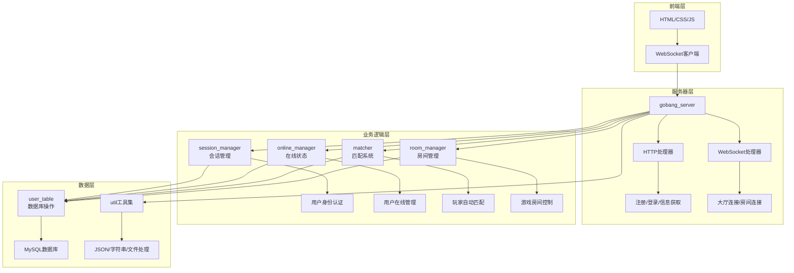
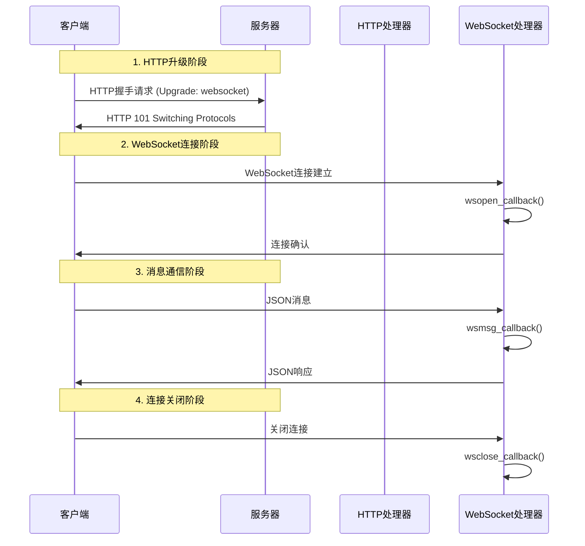

# C++在线五子棋项目深度解析：从零基础到精通

## 目录
1. [项目概述与架构设计](#项目概述与架构设计)
2. [核心C++语法详解](#核心c语法详解)
3. [WebSocket通信机制](#websocket通信机制)
4. [多线程与线程安全](#多线程与线程安全)
5. [智能指针与内存管理](#智能指针与内存管理)
6. [JSON数据处理](#json数据处理)
7. [数据库操作](#数据库操作)
8. [项目架构设计模式](#项目架构设计模式)
9. [面试重点与技术亮点](#面试重点与技术亮点)

---

## 项目概述与架构设计

### 整体架构图


### 核心模块依赖关系
| 模块 | 职责 | 依赖关系 |
|------|------|----------|
| `server.hpp` | 主控制器 | 依赖所有其他模块 |
| `session.hpp` | 会话管理 | 依赖 util.hpp |
| `online.hpp` | 在线状态 | 依赖 util.hpp |
| `matcher.hpp` | 匹配系统 | 依赖 online, db, room |
| `room.hpp` | 房间管理 | 依赖 online, db |
| `db.hpp` | 数据库操作 | 依赖 util.hpp |
| `util.hpp` | 工具函数 | 无依赖（基础模块） |

---

## 核心C++语法详解

### 1. 类的定义与初始化列表

#### 语法格式
```cpp
class ClassName {
private:
    // 私有成员变量
    type member1;
    type member2;
    
public:
    // 构造函数 - 初始化列表语法
    ClassName(params) : member1(value1), member2(value2) {
        // 构造函数体
    }
};
```

#### 项目实例分析
```cpp
class gobang_server {
private:
    std::string _web_root;        // 静态资源根目录
    wsserver_t _wssrv;           // WebSocket服务器对象
    user_table _ut;              // 数据库操作对象
    online_manager _om;          // 在线用户管理对象
    
public:
    gobang_server(const std::string &host,
                  const std::string &user,
                  const std::string &pass,
                  const std::string &dbname,
                  uint16_t port = 3306):
        _web_root("./wwwroot/"),     // 成员1初始化
        _ut(host, user, pass, dbname, port),  // 成员2初始化
        _rm(&_ut, &_om),            // 成员3初始化（传递指针）
        _sm(&_wssrv) {              // 成员4初始化
        // 构造函数体：设置WebSocket回调
        _wssrv.set_http_handler(std::bind(&gobang_server::http_callback, 
                                         this, std::placeholders::_1));
    }
};
```

#### 初始化列表的优势
1. **效率更高**：直接初始化，避免先默认构造再赋值
2. **必须使用的情况**：
   - const成员变量
   - 引用成员变量
   - 没有默认构造函数的对象成员

### 2. 函数指针与std::bind

#### std::bind语法详解
```cpp
// 基本语法
std::bind(函数地址, 对象指针, 占位符...);

// 项目中的实际使用
_wssrv.set_http_handler(
    std::bind(&gobang_server::http_callback,    // 成员函数地址
              this,                             // 对象指针
              std::placeholders::_1)            // 第一个参数占位符
);
```

#### 占位符说明
| 占位符 | 含义 |
|--------|------|
| `std::placeholders::_1` | 第1个参数 |
| `std::placeholders::_2` | 第2个参数 |
| `std::placeholders::_3` | 第3个参数 |

### 3. 引用与指针的使用

#### 引用语法对比
```cpp
// 值传递 - 会复制对象
void func1(std::string str) {
    // str是副本，修改不影响原对象
}

// 引用传递 - 操作原对象
void func2(std::string& str) {
    // str是原对象的别名，修改会影响原对象
}

// 常量引用 - 只读访问
void func3(const std::string& str) {
    // str只能读取，不能修改，但避免了复制
}
```

#### 项目中的应用
```cpp
// HTTP响应函数 - 使用引用避免复制connection对象
void http_resp(wsserver_t::connection_ptr &conn,     // 引用传递
               bool result, 
               websocketpp::http::status_code::value code, 
               const std::string &reason) {           // 常量引用
    // 函数体
}
```

---

## WebSocket通信机制

### WebSocket生命周期图


### WebSocket回调函数详解

#### 1. 连接建立回调
```cpp
void wsopen_callback(websocketpp::connection_hdl hdl) {
    // 1. 获取连接对象
    wsserver_t::connection_ptr conn = _wssrv.get_con_from_hdl(hdl);
    
    // 2. 获取请求信息
    websocketpp::http::parser::request req = conn->get_request();
    std::string uri = req.get_uri();
    
    // 3. 根据URI路由到不同处理函数
    if (uri == "/hall") {
        return wsopen_game_hall(conn);
    } else if (uri == "/room") {
        return wsopen_game_room(conn);
    }
}
```

#### 2. 消息处理回调
```cpp
void wsmsg_callback(websocketpp::connection_hdl hdl, 
                   wsserver_t::message_ptr msg) {
    // 1. 获取连接和消息内容
    wsserver_t::connection_ptr conn = _wssrv.get_con_from_hdl(hdl);
    std::string req_body = msg->get_payload();
    
    // 2. JSON反序列化
    Json::Value req_json;
    bool ret = json_util::unserialize(req_body, req_json);
    
    // 3. 根据URI分发处理
    std::string uri = conn->get_request().get_uri();
    if (uri == "/hall") {
        return wsmsg_game_hall(conn, msg);
    }
}
```

### HTTP vs WebSocket对比

| 特性 | HTTP | WebSocket |
|------|------|-----------|
| 连接性质 | 无状态，短连接 | 有状态，长连接 |
| 通信方向 | 单向（客户端发起） | 双向通信 |
| 数据格式 | 请求/响应报文 | 纯数据帧 |
| 适用场景 | 页面加载，API调用 | 实时通信，游戏同步 |

---

## 多线程与线程安全

### 线程安全的经典模式

#### 1. 互斥锁（Mutex）
```cpp
#include <mutex>

class ThreadSafeClass {
private:
    std::mutex _mutex;                    // 互斥锁
    std::unordered_map<int, string> _data; // 共享数据
    
public:
    void insert(int key, const string& value) {
        std::unique_lock<std::mutex> lock(_mutex);  // 自动加锁
        _data[key] = value;
        // lock析构时自动解锁
    }
    
    bool find(int key, string& value) {
        std::unique_lock<std::mutex> lock(_mutex);
        auto it = _data.find(key);
        if (it != _data.end()) {
            value = it->second;
            return true;
        }
        return false;
    }
};
```

#### 2. 条件变量（Condition Variable）
```cpp
#include <condition_variable>

template<class T>
class BlockingQueue {
private:
    std::queue<T> _queue;
    std::mutex _mutex;
    std::condition_variable _cond;
    
public:
    void push(const T& item) {
        std::unique_lock<std::mutex> lock(_mutex);
        _queue.push(item);
        _cond.notify_one();  // 唤醒等待的线程
    }
    
    T pop() {
        std::unique_lock<std::mutex> lock(_mutex);
        while (_queue.empty()) {
            _cond.wait(lock);  // 队列为空时阻塞等待
        }
        T item = _queue.front();
        _queue.pop();
        return item;
    }
};
```

### 项目中的匹配队列实现

#### 线程安全的匹配队列
```cpp
template <class T>
class match_queue {
private:
    std::list<T> _list;                    // 使用list支持中间删除
    std::mutex _mutex;                     // 保护共享数据
    std::condition_variable _cond;         // 条件变量

public:
    void push(const T &data) {
        std::unique_lock<std::mutex> lock(_mutex);
        _list.push_back(data);
        _cond.notify_all();                // 唤醒所有等待线程
    }
    
    void wait() {
        std::unique_lock<std::mutex> lock(_mutex);
        _cond.wait(lock);                  // 等待条件满足
    }
    
    bool pop(T &data) {
        std::unique_lock<std::mutex> lock(_mutex);
        if (_list.empty()) return false;
        data = _list.front();
        _list.pop_front();
        return true;
    }
};
```

### 线程安全设计原则

1. **最小锁定范围**：只在必要时持有锁
2. **避免死锁**：按固定顺序获取多个锁
3. **使用RAII**：unique_lock自动管理锁的生命周期
4. **条件变量配合**：避免忙等待，提高效率

---

## 智能指针与内存管理

### 智能指针类型对比

| 智能指针类型 | 所有权 | 复制行为 | 使用场景 |
|-------------|--------|----------|----------|
| `unique_ptr` | 独占 | 不可复制，可移动 | 独占资源管理 |
| `shared_ptr` | 共享 | 可复制，引用计数 | 共享资源管理 |
| `weak_ptr` | 不拥有 | 弱引用，不影响计数 | 打破循环引用 |

### 项目中的智能指针应用

#### 1. 会话指针定义
```cpp
// session.hpp中的定义
using session_ptr = std::shared_ptr<session>;

// 为什么使用shared_ptr？
// 1. 多个地方可能需要访问同一个session
// 2. 自动内存管理，避免内存泄漏
// 3. 线程安全的引用计数
```

#### 2. 连接指针的使用
```cpp
// WebSocket连接指针
typedef websocketpp::server<websocketpp::config::asio_no_tls> wsserver_t;
using connection_ptr = wsserver_t::connection_ptr;  // 这是一个shared_ptr

// 在线管理中的应用
class online_manager {
private:
    // 用户ID -> 连接指针的映射
    std::unordered_map<uint64_t, wsserver_t::connection_ptr> _hall_user;
    
public:
    void enter_game_hall(uint64_t uid, wsserver_t::connection_ptr &conn) {
        std::unique_lock<std::mutex> lock(_mutex);
        _hall_user.insert(std::make_pair(uid, conn));  // shared_ptr可以安全复制
    }
};
```

#### 3. 智能指针的最佳实践
```cpp
// ✅ 推荐：使用make_shared
std::shared_ptr<session> ssp = std::make_shared<session>(session_id);

// ❌ 不推荐：直接new
std::shared_ptr<session> ssp(new session(session_id));

// ✅ 推荐：检查空指针
if (ssp.get() != nullptr) {
    ssp->some_method();
}

// ✅ 推荐：使用auto简化类型
auto ssp = std::make_shared<session>(session_id);
```

### RAII设计模式

#### 资源获取即初始化
```cpp
class FileHandler {
private:
    FILE* file;
    
public:
    FileHandler(const string& filename) {
        file = fopen(filename.c_str(), "r");
        if (!file) {
            throw std::runtime_error("Failed to open file");
        }
    }
    
    ~FileHandler() {
        if (file) {
            fclose(file);  // 析构时自动释放资源
        }
    }
    
    // 禁止复制，只允许移动
    FileHandler(const FileHandler&) = delete;
    FileHandler& operator=(const FileHandler&) = delete;
};
```

---

## JSON数据处理

### JSON在项目中的作用流程图


### JSON处理工具函数详解

#### 1. 序列化函数
```cpp
namespace json_util {
    bool serialize(const Json::Value& root, std::string& body) {
        Json::StreamWriterBuilder swb;
        std::unique_ptr<Json::StreamWriter> sw(swb.newStreamWriter());
        std::ostringstream oss;
        
        if (sw->write(root, &oss) != 0) {
            return false;
        }
        body = oss.str();
        return true;
    }
}
```

#### 2. 反序列化函数
```cpp
namespace json_util {
    bool unserialize(const std::string& body, Json::Value& root) {
        Json::CharReaderBuilder crb;
        std::unique_ptr<Json::CharReader> cr(crb.newCharReader());
        std::string errs;
        
        return cr->parse(body.c_str(), 
                        body.c_str() + body.size(), 
                        &root, &errs);
    }
}
```

### 项目中的JSON消息格式

#### 1. 用户注册请求
```json
{
    "username": "player1",
    "password": "123456"
}
```

#### 2. 登录响应
```json
{
    "result": true,
    "reason": "登录成功",
    "user_id": 12345
}
```

#### 3. 匹配成功通知
```json
{
    "optype": "match_success",
    "result": true,
    "room_id": 1001
}
```

#### 4. 游戏房间状态
```json
{
    "optype": "room_ready",
    "result": true,
    "room_id": 1001,
    "white_id": 12345,
    "black_id": 12346
}
```

---

## 数据库操作

### 数据库表结构设计

#### 用户表（db.sql）
```sql
CREATE TABLE IF NOT EXISTS user (
    id INT AUTO_INCREMENT PRIMARY KEY,
    username VARCHAR(50) UNIQUE NOT NULL,
    password VARCHAR(100) NOT NULL,
    score INT DEFAULT 1000,
    total_count INT DEFAULT 0,
    win_count INT DEFAULT 0
);
```

### 字段说明
| 字段 | 类型 | 说明 | 默认值 |
|------|------|------|--------|
| id | INT | 主键，用户唯一标识 | 自增 |
| username | VARCHAR(50) | 用户名，唯一约束 | - |
| password | VARCHAR(100) | 密码 | - |
| score | INT | 天梯分数 | 1000 |
| total_count | INT | 总场次 | 0 |
| win_count | INT | 胜利场次 | 0 |

### 数据库操作类详解

#### 1. 用户注册
```cpp
bool user_table::insert(Json::Value &user) {
    // 1. 提取用户信息
    std::string username = user["username"].asString();
    std::string password = user["password"].asString();
    
    // 2. 构建SQL语句
    std::stringstream sql;
    sql << "INSERT INTO user (username, password) VALUES (";
    sql << "'" << username << "', '" << password << "')";
    
    // 3. 执行SQL
    bool ret = mysql_util::mysql_exec(_mysql, sql.str());
    if (!ret) return false;
    
    // 4. 获取新插入记录的ID
    uint64_t uid = mysql_insert_id(_mysql);
    user["id"] = (Json::UInt64)uid;
    return true;
}
```

#### 2. 用户登录验证
```cpp
bool user_table::login(Json::Value &user) {
    std::string username = user["username"].asString();
    std::string password = user["password"].asString();
    
    std::stringstream sql;
    sql << "SELECT id, score, total_count, win_count FROM user WHERE ";
    sql << "username='" << username << "' AND password='" << password << "'";
    
    MYSQL_RES *res = nullptr;
    bool ret = mysql_util::mysql_exec(_mysql, sql.str(), &res);
    if (!ret || mysql_num_rows(res) != 1) {
        if (res) mysql_free_result(res);
        return false;
    }
    
    // 填充用户信息
    MYSQL_ROW row = mysql_fetch_row(res);
    user["id"] = (Json::UInt64)std::stol(row[0]);
    user["score"] = std::stoi(row[1]);
    user["total_count"] = std::stoi(row[2]);
    user["win_count"] = std::stoi(row[3]);
    
    mysql_free_result(res);
    return true;
}
```

---

## 项目架构设计模式

### 1. 单例模式在日志系统中的应用
```cpp
class Logger {
private:
    static Logger* instance;
    std::ofstream log_file;
    std::mutex log_mutex;
    
    Logger() {
        log_file.open("game.log", std::ios::app);
    }
    
public:
    static Logger* getInstance() {
        if (instance == nullptr) {
            instance = new Logger();
        }
        return instance;
    }
    
    void log(const std::string& message) {
        std::unique_lock<std::mutex> lock(log_mutex);
        log_file << "[" << getCurrentTime() << "] " << message << std::endl;
    }
};
```

### 2. 观察者模式在房间广播中的应用
```cpp
class Room {
private:
    std::vector<std::shared_ptr<Player>> observers;
    
public:
    void addObserver(std::shared_ptr<Player> player) {
        observers.push_back(player);
    }
    
    void notifyAll(const Json::Value& message) {
        for (auto& player : observers) {
            player->notify(message);
        }
    }
};
```

### 3. 策略模式在匹配算法中的应用
```cpp
class MatchStrategy {
public:
    virtual bool shouldMatch(const Player& p1, const Player& p2) = 0;
};

class ScoreBasedMatch : public MatchStrategy {
public:
    bool shouldMatch(const Player& p1, const Player& p2) override {
        return abs(p1.getScore() - p2.getScore()) <= 200;
    }
};

class Matcher {
private:
    std::unique_ptr<MatchStrategy> strategy;
    
public:
    void setStrategy(std::unique_ptr<MatchStrategy> s) {
        strategy = std::move(s);
    }
};
```

---

## 面试重点与技术亮点

### 技术亮点总结

1. **多线程并发处理**
   - 3个独立的匹配线程处理不同等级玩家
   - 线程安全的阻塞队列实现
   - 条件变量优化等待机制

2. **WebSocket双向通信**
   - HTTP升级到WebSocket协议
   - 实时游戏状态同步
   - 基于URI的路由分发

3. **智能内存管理**
   - 广泛使用智能指针避免内存泄漏
   - RAII设计模式管理资源
   - 引用计数自动回收

4. **会话生命周期管理**
   - 基于Cookie的身份验证
   - 定时器控制会话过期
   - 动态切换临时/永久会话

### 常见面试问题与回答

#### Q1: 如何保证多线程环境下的数据安全？
**回答要点：**
- 使用std::mutex保护共享数据
- std::unique_lock实现RAII自动管理锁
- 条件变量避免忙等待
- 最小化锁的持有时间

#### Q2: 为什么选择WebSocket而不是HTTP轮询？
**回答要点：**
- WebSocket支持双向实时通信
- 避免HTTP轮询的延迟和资源浪费
- 保持长连接，减少握手开销
- 更适合实时游戏场景

#### Q3: 智能指针的选择依据是什么？
**回答要点：**
- shared_ptr用于需要共享的资源（如session、connection）
- unique_ptr用于独占资源
- 引用计数自动管理内存生命周期
- 避免手动delete导致的内存泄漏

#### Q4: 如何处理客户端异常断开？
**回答要点：**
- WebSocket连接断开自动触发wsclose_callback
- 从在线管理器中移除用户
- 清理房间中的玩家信息
- 恢复session的定时管理

### 项目扩展建议

1. **性能优化**
   - 连接池管理数据库连接
   - 内存池减少频繁分配
   - 负载均衡支持多服务器

2. **功能扩展**
   - 支持观战功能
   - 添加聊天系统
   - 实现录像回放

3. **监控与运维**
   - 完善日志系统
   - 添加性能监控
   - 异常报警机制

---

## 总结

本项目是一个完整的C++后端项目，涵盖了：
- 现代C++特性的使用（智能指针、RAII、线程）
- 网络编程（WebSocket、HTTP）
- 数据库操作（MySQL）
- 多线程编程与同步
- 设计模式的实际应用

通过这个项目，可以深入理解C++后端开发的核心技术栈，为面试和实际工作打下坚实基础。

---

*本文档持续更新，欢迎交流讨论！*
