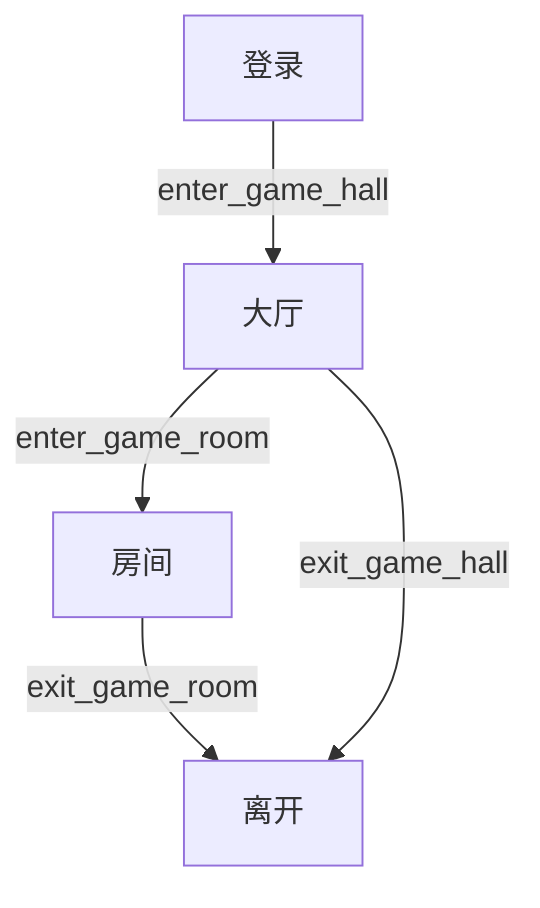

# 学习笔记 - 2025-06-30

## 今日主题：online.hpp（在线状态管理）

### 1. 作用
- 管理所有在线用户的状态和WebSocket连接，分为"游戏大厅"和"游戏房间"两类。

### 2. 主要成员变量
- `std::mutex _mutex;` 互斥锁，保证多线程安全。
- `std::unordered_map<uint64_t, wsserver_t::connection_ptr> _hall_user;` 游戏大厅用户ID到连接的映射。
- `std::unordered_map<uint64_t, wsserver_t::connection_ptr> _room_user;` 游戏房间用户ID到连接的映射。

### 3. 主要成员函数
- `enter_game_hall/room`：用户进入大厅/房间时注册连接
- `exit_game_hall/room`：用户离开时移除连接
- `is_in_game_hall/room`：判断用户是否在线
- `get_conn_from_hall/room`：通过用户ID获取连接

### 4. 重点语法讲解
- 互斥锁（std::mutex, std::unique_lock）
- 哈希表（std::unordered_map）
- 智能指针
- auto关键字
- 线程安全写法

### 5. 用户状态流转图（建议手绘或用Mermaid画）

### 6. 练习建议
1. **多线程安全map操作demo**
   - 用C++写一个多线程安全的unordered_map，支持插入、查找、删除
   - 用std::thread和std::mutex实现
2. **RAII思想练习**
   - 用unique_lock管理互斥锁，体会自动加解锁
3. **哈希表和智能指针练习**
   - 用unordered_map<uint64_t, std::shared_ptr<int>>模拟用户ID到资源的映射
   - 实现插入、查找、删除

### 7. 今日收获
- 理解了在线用户管理的基本原理和线程安全写法
- 掌握了C++11的互斥锁、哈希表、智能指针和auto用法
- 明白了RAII思想在实际项目中的应用

### 8. 明日计划
- 继续学习 room.hpp（房间系统，核心）
- 完成相关练习
- 梳理房间管理的流程和数据结构 